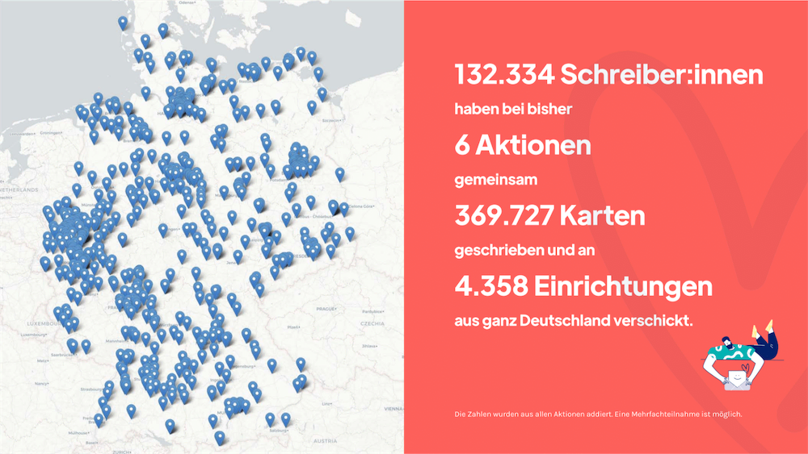

# Post mit Herz

Nicht erst seit der Corona-Pandemie leiden viele Menschen in Deutschland unter Einsamkeit. Manche haben keine Familie, niemanden, der sie anruft oder besucht. Sie leben zum Beispiel in Pflegeeinrichtungen, auf der Straße, in Wohnheimen oder in medizinischer Betreuung. Wir finden: Besonders in diesen harten Zeiten soll sich kein Mensch vergessen fühlen!

**Deshalb haben wir 2020 die ehrenamtliche Initiative Post mit Herz gegründet.**

**Unsere Mission:** Jeder einsame Mensch soll Post mit Herz bekommen.

Und du kannst uns dabei helfen: [postmitherz.org](https://postmitherz.org)